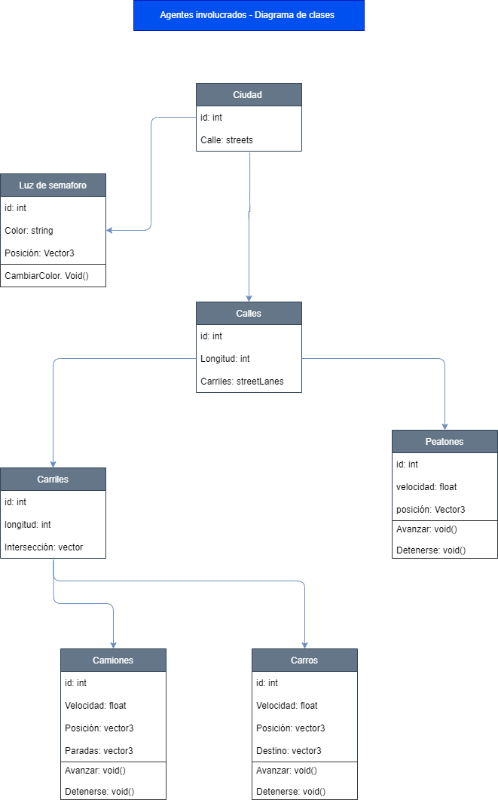
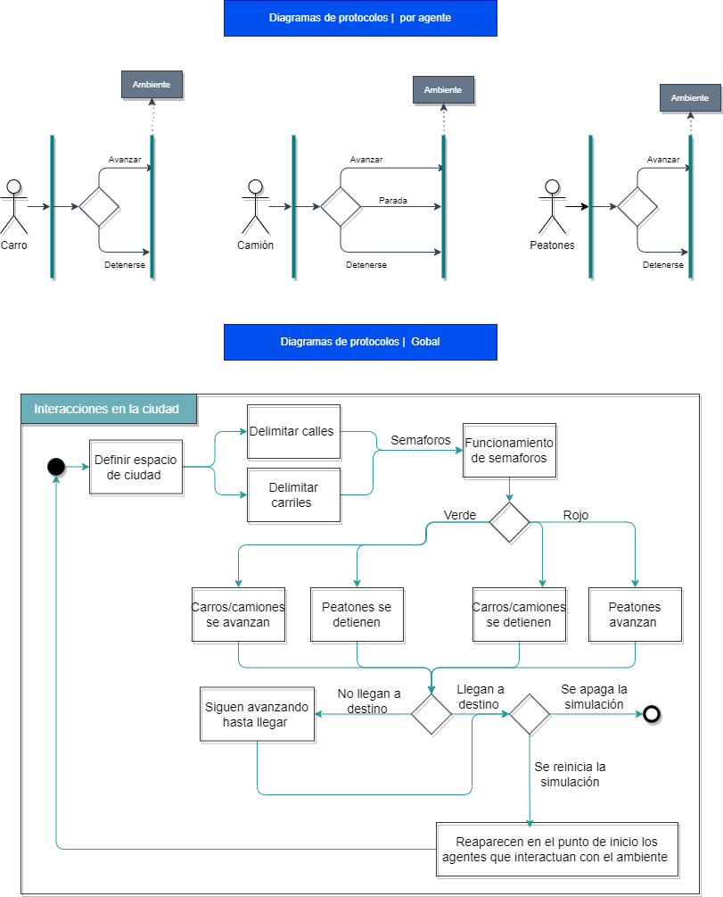

# Sobre la propuesta: 
## _Indice_ 
1. [Problema de movilidad urbana](#problema-de-movilidad-urbana)
2. [Propuesta formal](#propuesta-formal)
3. [Diagrama de agentes involucrados](#diagrama-de-agentes-involucrados)
4. [Diagrama de protocolos de interacción](#diagrama-de-protocolos-de-interacción)
5. [Plan de trabajo](#plan-de-trabajo)
6. [Sobre los integrantes del equipo](#sobre-los-integrantes-del-equipo)

---
## _Problema de movilidad urbana:_
Por muchos años se vio el uso de automóviles como un signo de progreso, sin embargo, el crecimiento y uso indiscriminado ha generado efectos negativos asociados con la “movilidad sostenible”, ocasionando también efectos negativos en los niveles económico, ambiental y social en México, por mencionar un ejemplo, los Kilómetros-Auto Recorridos (VKT por sus siglas en Inglés) se han triplicado, de 106 millones en 1990, a 339 millones en 2010. Ésto se correlaciona simultáneamente con un incremento en los impactos negativos asociados a los autos, como el smog, accidentes, enfermedades y congestión vehicular. 

## _Propuesta formal:_
Tomando en cuenta el contexto anterior,  para que México pueda mejorar su economía, es necesario mejorar la movilidad en sus ciudades, implicando un reto. Este reto permitirá contribuir a la solución del problema de movilidad urbana, mediante un enfoque que reduzca la congestión vehicular al simular de manera gráfica el tráfico, representando la salida de un sistema multi agentes.

El reto consiste en proponer una solución al problema de movilidad urbana en México, mediante un enfoque que reduzca la congestión vehicular al simular de manera gráfica el tráfico, representando la salida de un sistema multi agentes.

En otras palabras, la solución que se busca implementar consiste en simular la situación tomando ciertas estrategias como guía, por ejemplo: 
* Tomar las rutas menos congestionadas. Quizás no más las cortas, pero las rutas con menos tráfico. Más movilidad, menos consumo, menos contaminación.
* Que permita a los semáforos coordinar sus tiempos y, así, reducir la congestión de un cruce. O, quizás, indicar en qué momento un vehículo va a cruzar una intersección y que de esta forma, el semáforo puede determinar el momento y duración de la luz verde

## _Diagrama de agentes involucrados_

## _Diagrama de protocolos de interacción_

## _Plan de trabajo_ 
Se consideran las siguientes etapas de desarrollo del proyecto: 

* Etapa 1.1: Modelación de agentes
* Etapa 1.2: Modelación gráfica en tres dimensiones
* Etapa 2.1: Interacción entre agentes
* Etapa 2.2: Animación gráfica en tres dimensiones

Las cuales se desarrollarán a profundidad conforme se vayan conociendo las tareas a implementar. Para la gestión de las etapas y organización del proyecto se maneja un Trello como entorno de trabajo. 

---
## _Sobre los integrantes del equipo_ 

Para saber mas sobre quienes integran el proyecto, puede leer "Sobre el equipo" aqui: [Sobre el equipo](https://ubicacionpropuesta)

---