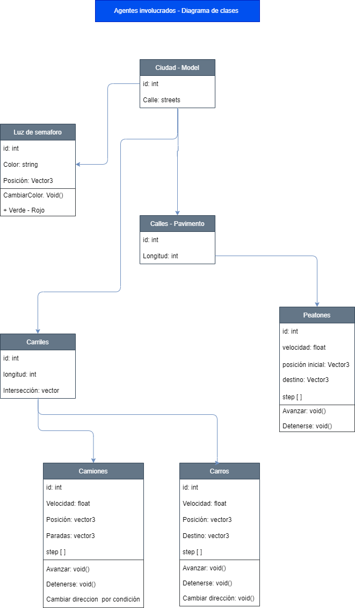
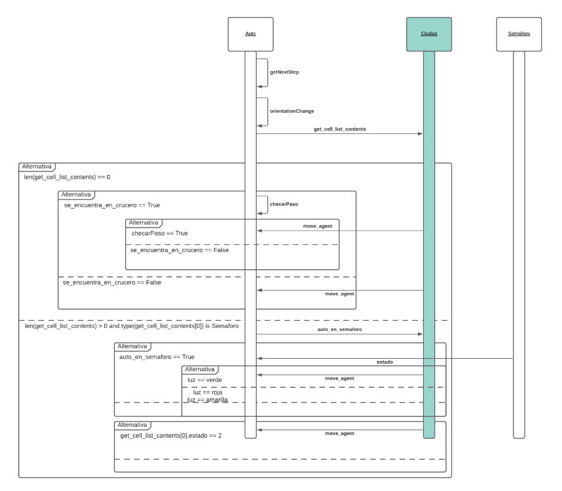
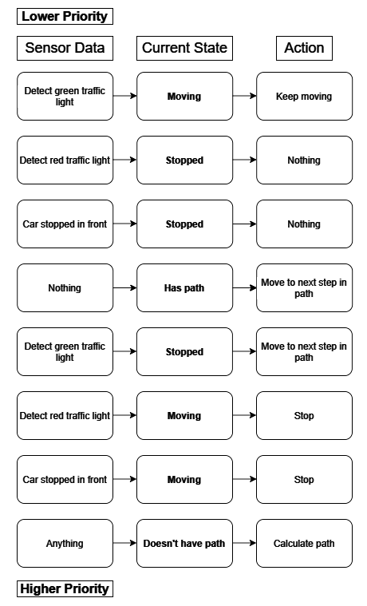

# Presentación del reto TC2008B 
## _Indice_ 
- [Presentación del reto TC2008B](#presentación-del-reto-tc2008b)
  - [_Indice_](#indice)
  - [_Instalacion_](#instalacion)
  - [_Propuesta formal_](#propuesta-formal)
  - [_Tarea M4_](#tarea-m4)
  - [_Modelacion de agentes_](#modelacion-de-agentes)
    - [_Agentes involucrados actualización_](#agentes-involucrados-actualización)
    - [_Interaccion entre agentes actualización:_](#interaccion-entre-agentes-actualización)
    - [_Prioridad de acciones_](#prioridad-de-acciones)

--- 
## _Instalacion_
Para instalar los requerimientos usamos

    pip install -r requirements.txt
## _Propuesta formal_ 

Al inicio del bloque se diseño una propuesta formal inicial que ha tenido leve cambios que se podran ver en el desarrollo de cada uno de los avances reportados. 

Para saber mas sobre el proyecto y la problematica, puede leerse la "propuesta formal inicial" aqui: [Propuesta formal](https://github.com/ivalani/Project-Multiagentes/blob/main/Arranque_de_proyecto/propuesta.md)

Esta parte de la entrega cuenta como el primer avance del proyecto, que conforma el "arranque del proyecto" 

## _Tarea M4_ 
Conforma el inicio y el modelado de los agentes que interactuan en la ciudad. 
Puedes ver mas a detalle [aqui](https://github.com/ivalani/Project-Multiagentes/blob/main/Arranque_de_proyecto/propuesta.md)

## _Modelacion de agentes_ 
Esta parte del proyecto se cuenta como el segundo avance del proyecto, donde: 

### _Agentes involucrados actualización_
Se presentan los agentes de la propuesta formal, con ligeros cambios

### _Interaccion entre agentes actualización:_

Se presenta una definición de interacciones y protocolos basicos entre los agentes que deben de presentarse minimamente, es decir, en este proyecto se espera poder añadir un agente "autobus" que actua como un agente aparte de los "autos", tambien el agente "peatones" esta considerado como un agente extra, por ello se crea un diagrama minimo esperado. 

Se mantiene la interacción global definida previamente en el primer avance. 

### _Prioridad de acciones_ 

Acciones basicas que seran tomadas como base, se actualizaran conforme sea necesario

